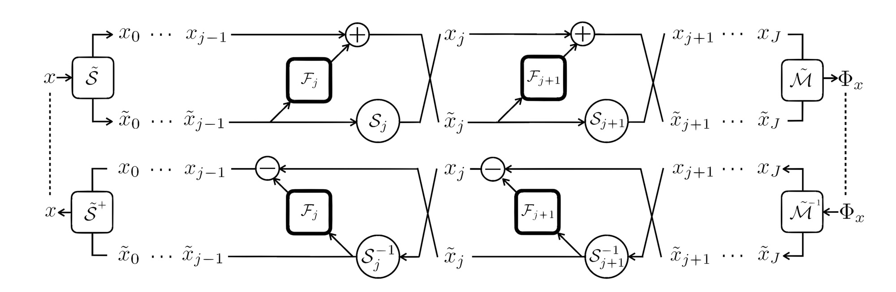
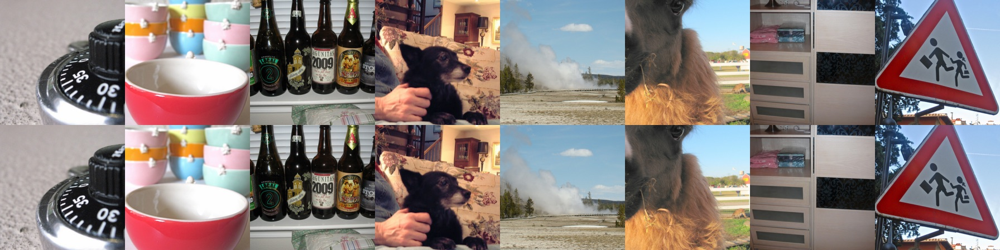

## i-RevNet: Deep Invertible Networks

Pytorch implementation of i-RevNets. 

i-RevNets define a family of fully invertible deep networks, built from a succession of homeomorphic layers.

Reference: [Jörn-Henrik Jacobsen](https://jhjacobsen.github.io/), [Arnold Smeulders](https://scholar.google.nl/citations?user=aa5Ou7gAAAAJ&hl=en), [Edouard Oyallon](https://edouardoyallon.github.io/). [i-RevNet: Deep Invertible Networks](https://openreview.net/pdf?id=HJsjkMb0Z). *International Conference on Learning Representations (ICLR), 2018. (https://iclr.cc/)*




The i-RevNet and its dual. The inverse can be obtained from the forward model with minimal adaption and is an i-RevNet as well. Read the paper for theoretical background and detailed analysis of the trained models.


## Pytorch i-RevNet Usage

Requirements: Python 3, Numpy, Pytorch, Torchvision

Download the ImageNet dataset and move validation images to labeled subfolders.
To do this, you can use the following script: https://raw.githubusercontent.com/soumith/imagenetloader.torch/master/valprep.sh

We provide an Imagenet pre-trained model: [Download](https://drive.google.com/uc?id=1eQtZIpmtVM0-JDv_2nx3xMuGKjA1beLF&export=download) \
Save it to [this](checkpoint/ilsvrc2012/pre-trained/) folder.

Train small i-RevNet on Cifar-10, takes about 5 hours and yields an accuracy of ~94.5%
```
$ python CIFAR_main.py --nBlocks 18 18 18 --nStrides 1 2 2 --nChannels 16 64 256
```
Train bijective i-RevNet on Imagenet, takes 7-10 days and yields top-1 accuracy of ~74%
```
$ python ILSVRC_main.py --data /path/to/ILSVRC2012/ --nBlocks 6 16 72 6 --nStrides 2 2 2 2 --nChannels 24 96 384 1536 --init_ds 2
```
Evaluate pre-trained model on Imagenet validation set, yields 74.018% top-1 accuracy
```
$ bash scripts/evaluate_ilsvrc-2012.sh
```
Invert output of last layer on Imagenet validation set and save example images
```
$ bash scripts/invert_ilsvrc-2012.sh
```

## Imagenet ILSVRC-2012 Results

i-RevNets perform on par with baseline RevNet and ResNet.


| Model:           | ResNet | RevNet | i-RevNet (a) | i-RevNet (b) |
|------------------|--------|--------|--------------|--------------|
| Val Top-1 Error: |  24.7  |  25.2  |    24.7      |    26.0      |

Reconstructions from ILSVRC-2012 validation set. Top row original image, bottom row reconstruction from final representation.



## Contribute

Contributions are very welcome.


## Cite

```bibtex
@inproceedings{
jacobsen2018irevnet,
title={i-RevNet: Deep Invertible Networks},
author={Jörn-Henrik Jacobsen and Arnold W.M. Smeulders and Edouard Oyallon},
booktitle={International Conference on Learning Representations},
year={2018},
url={https://openreview.net/forum?id=HJsjkMb0Z},
}
```
